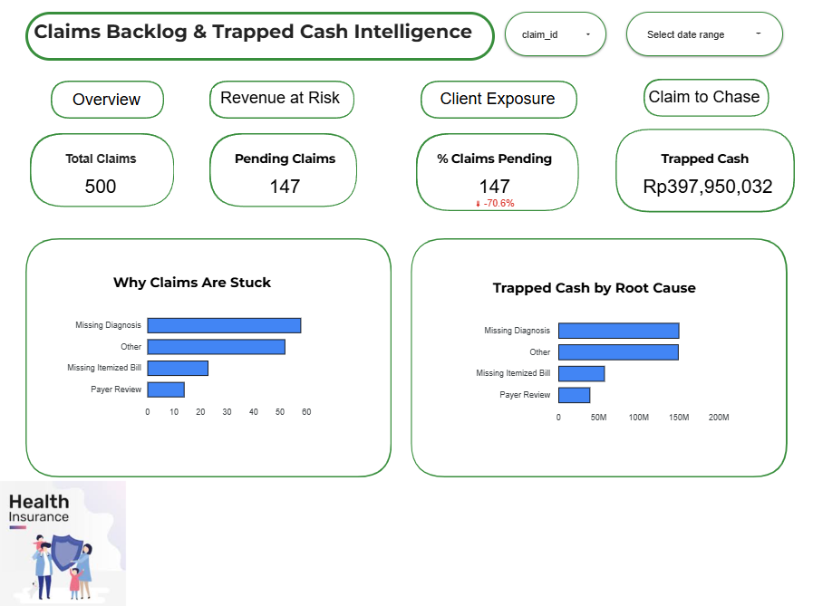
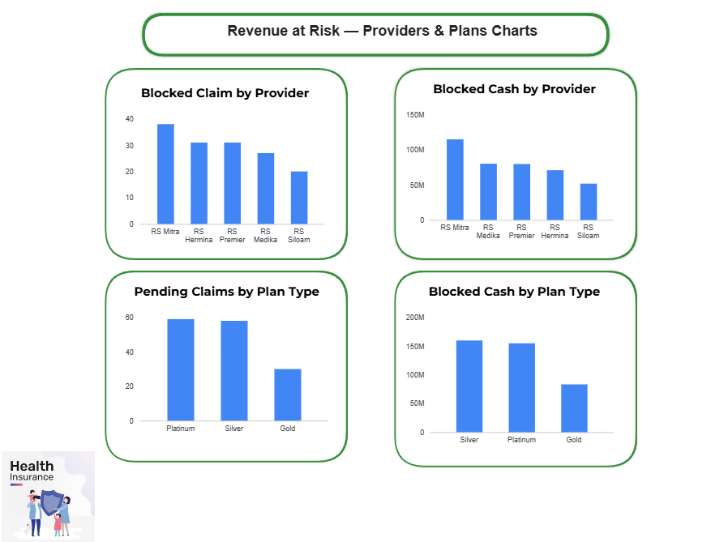
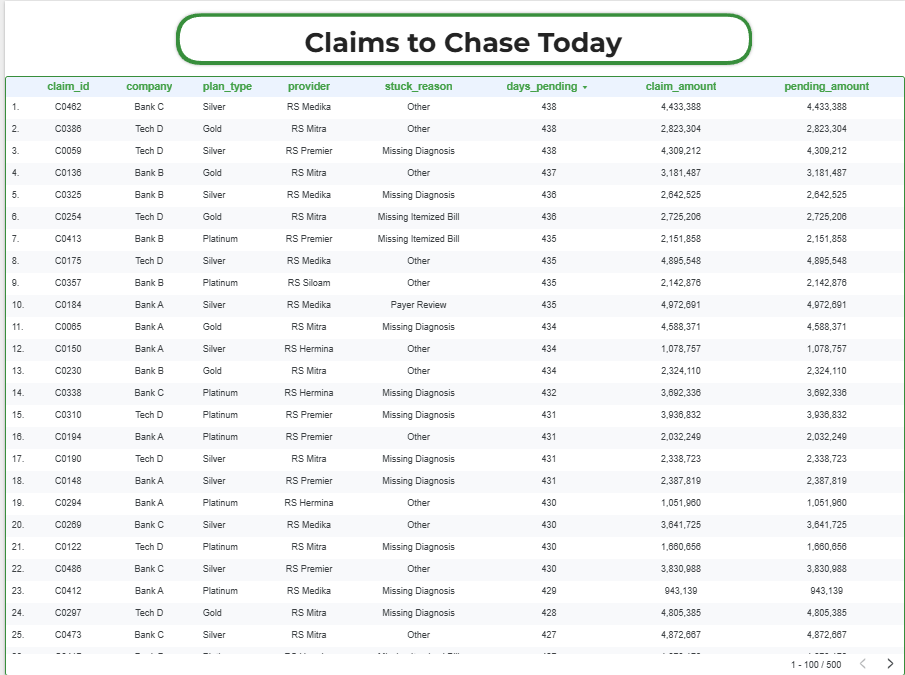

# 🏥 Healthcare Claims Backlog & Trapped Cash Intelligence

> **An end-to-end healthcare operations analytics dashboard** built to identify where insurance revenue is getting stuck, why it happens, and which claims should be prioritized to unlock cash flow.

[](https://lookerstudio.google.com/reporting/e526fd0e-2f37-41bc-863f-ed83c8aa31b3)


---

## 📌 Problem Statement

In healthcare insurance operations, pending claims create **trapped cash** — revenue that has been earned but not yet collected. Without visibility into *why* claims are stuck and *which* ones to prioritize, ops teams waste time chasing low-value claims while high-value ones age further.

This project simulates a real-world scenario where **~30% of total claims are pending**, locking up approximately **Rp 397,950,032** in unpaid healthcare revenue.

---

## 🎯 Objectives

- Identify the root causes of claim backlogs across providers, plan types, and client companies
- Quantify the financial impact of each root cause (trapped cash)
- Expose which hospitals, plans, and corporate clients are driving the largest cash-flow risk
- Give ops teams an actionable prioritization view — highest value, longest stuck claims first

---

## 🛠️ Tools & Skills

| Tool | Usage |
|------|-------|
| **Google Sheets** | Data modeling, SQL-style calculated fields, data cleaning |
| **Looker Studio** | Dashboard design, interactive filtering, multi-page reporting |

---

## 📊 Dashboard Overview

The dashboard consists of **4 pages**, each serving a different stakeholder need:

### 1. Executive Overview
High-level KPIs and root cause breakdown — designed for leadership to see the big picture at a glance.



**Key metrics:**
- Total Claims: **500**
- Pending Claims: **147** (29.4%)
- Trapped Cash: **Rp 397,950,032**
- Top root cause: **Missing Diagnosis** (58 claims, ~Rp 150M)

---

### 2. Revenue at Risk — Providers & Plans
Breaks down blocked claims and cash by hospital provider and insurance plan type.



---

### 3. Client Revenue Exposure
Shows which corporate clients (Bank A, Bank B, Bank C, Tech D) are contributing the most to the backlog.


---

### 4. Claims to Chase Today
Actionable table sorted by days pending — gives ops teams a daily priority list to work from.



---

## 🔍 Key Findings

- **29.4% of all claims are stuck**, representing nearly Rp 398M in trapped revenue
- **Missing Diagnosis** is the #1 root cause by both claim count (58) and cash impact (~Rp 150M)
- **RS Mitra** has the highest number of blocked claims among providers
- **Bank B** has the highest blocked cash exposure among client companies
- **Platinum & Silver plan holders** account for the majority of pending claims

---

## 💡 Recommendations

1. **Prioritize Missing Diagnosis resolution** — highest ROI since it affects the most claims and the most cash
2. **Engage RS Mitra directly** — provider-level bottleneck needs compliance improvement
3. **Flag Bank B accounts** for expedited follow-up given highest cash exposure
4. **Use the "Claims to Chase Today" table daily** — focus on 430+ days pending claims first

---

## 📁 Repository Structure

```
healthcare_claim/
├── README.md
├── screenshot/
│   ├── overview.png
│   ├── rar.png
│   ├── cre.png
│   └── chase.png
└── Data/
    └── claims_data.csv
```

---

## 👩‍💻 About

**Project type:** Portfolio Project (Study Case)  
**Domain:** Healthcare Insurance Operations Analytics  
**Timeline:** January 2026 – Present  

*Data used in this project is simulated/anonymized for portfolio purposes.*
